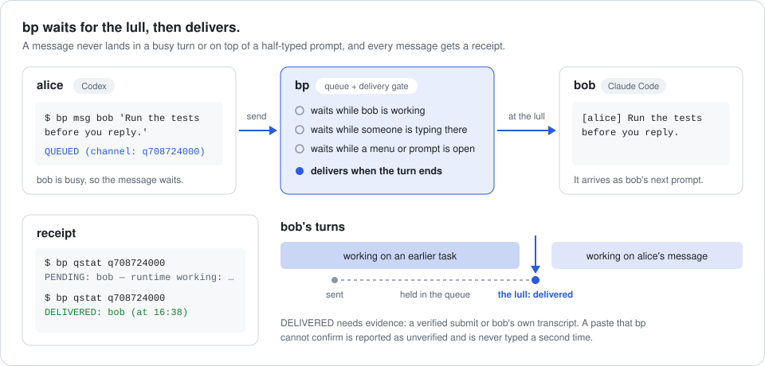

# bp

**bp lets your agents find each other, message each other and work as a team,
whatever they run in and wherever they run.**

[](https://github.com/tunapro1234/blueprint/actions/workflows/check.yml?query=branch%3Adev)
[](CHANGELOG.md)
[](LICENSE)

<picture>
  <source media="(prefers-color-scheme: dark)" srcset="docs/assets/delivery-flow-dark.svg">
  
</picture>

bp (Blueprint) is a small command-line tool that connects the AI agents on
your machine: Claude Code, Codex, Hermes, OpenCode, and any script that can
make an HTTP request. It waits for the lull, the quiet moment between an
agent's turns, then delivers, and it tells you honestly whether the message
arrived. bp is not an agent harness and never calls a model itself.

## Why bp

- **It never interrupts.** A message to a busy agent waits until its turn ends.
  A message to an agent whose prompt holds your half-typed text waits until you
  send it. bp checks the screen and the agent's own transcript before it types.
- **Receipts you can trust.** Every message gets a channel id. `bp qstat` says
  `DELIVERED` only with evidence; a paste bp cannot confirm is reported as
  unconfirmed and is never typed a second time.
- **Across harnesses, no SDK.** Claude Code, Codex, Hermes and OpenCode run
  under bp and use the `bp` CLI or its MCP server; scripts and other tools can
  post through a local HTTP API with A2A-shaped bodies.

Only using Claude Code? Its built-in messaging between sessions may be all you
need. bp is for mixed teams across harnesses, with checkable receipts, draft
protection, and machine-to-machine links that don't go through a vendor cloud.

## Install

Ask your agent:

> Install bp from https://bp.tunapro.xyz

Or run the installer yourself (macOS or Linux):

```sh
curl -fsSL https://bp.tunapro.xyz/install.sh | sh
```

Installing doesn't change how your tools behave. The installer checks the
release signature (Ed25519) and SHA-256, then writes only these:

- `~/.local/bin/bp`
- `~/.blueprint/`, bp's own config, agent book and state
- `~/.claude/skills/blueprint/SKILL.md` and `~/.codex/skills/blueprint/SKILL.md`,
  a short note that tells Claude Code and Codex that bp exists (a skill of
  yours with that name is never overwritten)

No shell rc edits, no tmux settings, no MCP config, no services and no agent
started. Everything else is an opt-in [module](#modules). `bp uninstall`
removes what bp added (`--dry-run` lists it first) and keeps your config and
history unless you add `--purge`.

## Quickstart

You need [tmux](https://github.com/tmux/tmux) and at least one agent CLI you
are signed in to. Start each agent from a regular terminal, not from inside
tmux: bp opens it in its own tmux session and passes your arguments through.

```sh
bp run --name alice codex     # terminal 1
bp run --name bob claude      # terminal 2
```

Now ask alice (Codex) in plain words: *"Use bp to ask bob to review the diff
in src/."* The note the installer added tells Codex and Claude Code how. Or
send it yourself from a third terminal:

```console
$ bp msg bob 'Please review the diff in src/ and tell alice what you find.'
sent
RESULT=delivered CHANNEL=q442887000
delivered: q442887000 -> bob
```

If bob is busy, the message waits for the lull:

```console
$ bp msg bob 'Run the tests before you reply.'
QUEUED (channel: q708724000). Check: bp qstat q708724000
...
$ bp qstat q708724000         # after bob's turn ends
DELIVERED: bob (at 16:38)
```

bob (Claude Code) reads `[alice] Please review the diff…` as its next prompt
and can answer with `bp msg alice '…'`. A message sent from a plain terminal
carries your login name; for Codex on macOS, see [Known issues](#known-issues).
`bp status` shows who is here and who is busy. Quote messages with single
quotes: inside double quotes your shell would expand `$(…)` and backticks
before bp sees the text.

## Known issues

These are on `dev` and being fixed before the next release.

- On macOS, bp can't bind Codex agents to their conversation yet: macOS `lsof` doesn't report flock locks, and Codex 0.162 holds its thread writer lock in its app-server daemon child. Messages to Codex agents stay queued, and messages from them carry the unverified label `codex?:<thread>` instead of the agent name. Codex → Claude delivery works.
- tmux is required for everything that lists or reaches agents, including MCP and HTTP.
- `bp mcp` started outside a bp terminal speaks as your login user (`--as` and `BP_AGENT` are ignored); run MCP clients inside agents started with `bp run` for now.
- `bp msg` to an HTTP or MCP inbox agent doesn't reach its inbox yet; use `bp_send` or `POST /v1/messages`.

## How delivery works

bp uses the best path each agent has:

| Path | For | How the message arrives |
|---|---|---|
| Terminal | agents started with `bp run` | pasted into the prompt at a turn boundary, then submitted |
| Hooks | Claude Code sessions bp starts | handed over by Claude Code's own `UserPromptSubmit`, `Stop` and `SessionStart` hooks; nothing is typed |
| Inbox | scripts and tools that register over the HTTP API | kept until they read it (`GET /v1/inbox`) |
| Peer | agents on another machine | sent over P2P, then delivered by that machine's own queue |

Before typing, bp waits while the agent is working, while text it did not
write sits in the prompt, while a menu or permission dialog is open, and while
it cannot tell which conversation the terminal holds. Only the root
coordinator and bp's own infrastructure may push a message to a busy agent
(`--force-busy`), and never into a Hermes turn, where it would cancel the work.

| `bp qstat` says | Meaning |
|---|---|
| `PENDING: bob — <reason>` | stored and waiting; the reason says what for |
| `DELIVERED: bob (at 15:48)` | evidence that bob received it: a verified submit, bob's transcript or a hook hand-over |
| `UNCONFIRMED: bob (…)` | typed but not confirmed; bp will not type it again |
| `NOT DELIVERED (…)`, `CANCELED (…)` | final, with the reason |

Delivered means the agent received the message, not that it did the work
([edge cases and test matrix](docs/message-delivery.md)).

## Use it from your agents and scripts

**CLI.** `bp status`, `bp msg`, `bp qstat` and `bp whoami`, as above. Inside an
agent started with `bp run`, the terminal proves who is speaking.

**MCP.** `bp api config <client>` prints a ready snippet for claude, codex,
gemini, antigravity, grok, opencode, cursor and hermes. For Claude Code:

```sh
claude mcp add --scope user bp -- bp mcp
```

The server offers `bp_agents`, `bp_send`, `bp_status`, `bp_inbox` and
`bp_register`, plus rooms (`bp_room_*`) and a shared board (`bp_board_*`).
Inside a bp terminal the pane decides who is speaking (see
[Known issues](#known-issues) for MCP outside one).

**HTTP.** Nothing listens until you start it, and it binds loopback only:

```sh
bp serve --api --listen 127.0.0.1:8765 &
TOKEN="$(cat "$(bp api token --path)")"
curl -s -H "Authorization: Bearer $TOKEN" -H 'X-BP-Agent: ci' \
  -d '{"to":"alice","text":"Build finished: 0 failures"}' \
  http://127.0.0.1:8765/v1/messages
# {"id":"qp0a2260…","to":"alice","route":"queue","state":"accepted"}
```

alice reads `[http:ci] Build finished: 0 failures`; the `http:` prefix marks a
name bp could not verify. `GET /v1/messages/<id>` returns the receipt, and A2A
clients start at `/.well-known/agent-card.json`. See [docs/api.md](docs/api.md).

## Safety model

1. Installing adds only the bp binary, bp's own state and a short skill note for Claude Code and Codex; every behavior that touches your environment is a module that `bp disable` or `bp uninstall` undoes.
2. Text from outside this machine reaches an agent only inside a frame that names its source and marks it as untrusted data, not instructions.
3. Peers reach only the agents you expose to them; per-peer rate limits and loop caps stop floods and endless back-and-forth.
4. The API listens only when you start it, on loopback, with a token or peer credentials; API, peer and module decisions go to an audit log (`bp audit`).
5. Releases are signed and verified on install and update. bp is not a sandbox: agents under one OS user share that user's files ([SECURITY.md](SECURITY.md), [threat model](docs/security/threat-model.md)).

## Modules

Everything below is off until you turn it on. `bp modules` shows the state and
any conflict, `bp enable <module> --dry-run` shows what would change, and
`bp disable <module>` removes only what bp added. For a guided setup,
`bp onboard` opens a coordinator agent that explains the modules and enables
only what you choose.

| Module | When enabled |
|---|---|
| `sessions` | your usual `claude`, `codex`, `opencode` and `hermes` commands start through bp in tmux, so agents survive a closed terminal; the daemon reopens the coordinator |
| `bar` | tmux status bar with live agent state on the sessions bp opens |
| `guard-hooks` | tool-call tripwire for Claude agents: an alert when an agent that recently received outside text touches secrets or canary files |
| `compaction-hooks` | OpenCode and Hermes agents keep their bp identity and queued messages after a context compaction (needs `sessions`) |

Maintainer modules, not supported for general use yet:

| Module | What it is |
|---|---|
| `accounts` | several Claude accounts, usage limits, automatic switching and staggered keepalive; review your provider's terms first |
| `wa` | WhatsApp bridge for the maintainer's setup |
| `ui` | the maintainer's monitoring dashboard; contacts monitor.tunapro.xyz |
| `monitor` | jobs for the maintainer's `/srv/blueprint` server |

## Across machines

Two bp installs can message each other over libp2p, authenticated by
persistent Ed25519 machine keys: directly when the machines can reach each
other, otherwise through a relay you run. Each side lists the other's Peer ID
(`bp p2p id`) and which of its own agents that peer may reach; then
`bp msg main@laptop '…'` works like a local message. See [docs/p2p.md](docs/p2p.md).

## Requirements

- macOS 13 or later, or Linux, on amd64 or arm64. No native Windows.
- tmux, required today for everything that lists or reaches agents, including
  MCP and HTTP. Without it, `bp run` starts the CLI natively.
- bash or zsh for the `sessions` module's shell wrappers.
- `curl` and OpenSSL with Ed25519 to install (macOS: `brew install openssl@3`).
- Checked against Claude Code 2.1.295, Codex CLI 0.162.0 (macOS: see
  [Known issues](#known-issues)), Hermes Agent 0.20.5 and OpenCode 1.18.32
  ([matrix](docs/harnesses.json)). Hermes and OpenCode get the same waiting,
  but their deliveries stay unconfirmed for now.

## Documentation

| Page | Covers |
|---|---|
| [docs/usage.md](docs/usage.md) | every command, by task |
| [docs/api.md](docs/api.md) | HTTP, MCP, A2A, rooms, board, remote gateway |
| [docs/mcp.md](docs/mcp.md) | connect an agent through bp's MCP tools |
| [docs/message-delivery.md](docs/message-delivery.md) | queue states, receipts, edge cases |
| [docs/configuration.md](docs/configuration.md) | `config.yaml` reference and platform limits |
| [docs/p2p.md](docs/p2p.md) | machines, peers and relays |
| [docs/security/threat-model.md](docs/security/threat-model.md) | trust boundaries and mitigations |
| [docs/harnesses.json](docs/harnesses.json), [docs/runtime-status.md](docs/runtime-status.md) | per-harness capability matrix, `bp status --json` contract |
| [docs/windows.md](docs/windows.md), [docs/workflow.md](docs/workflow.md) | window integration, workflows |
| [DESIGN.md](DESIGN.md), [docs/local-release.md](docs/local-release.md) | architecture, build and release |
| [docs/direction.md](docs/direction.md) | where bp is going |
| [CHANGELOG.md](CHANGELOG.md) | what changed |

## Contributing and license

Bug reports and pull requests are welcome; start with
[CONTRIBUTING.md](CONTRIBUTING.md). Please do not report vulnerabilities in a
public issue; see [SECURITY.md](SECURITY.md). bp is licensed under the
[GNU General Public License v3.0](LICENSE) (SPDX: `GPL-3.0-only`).
